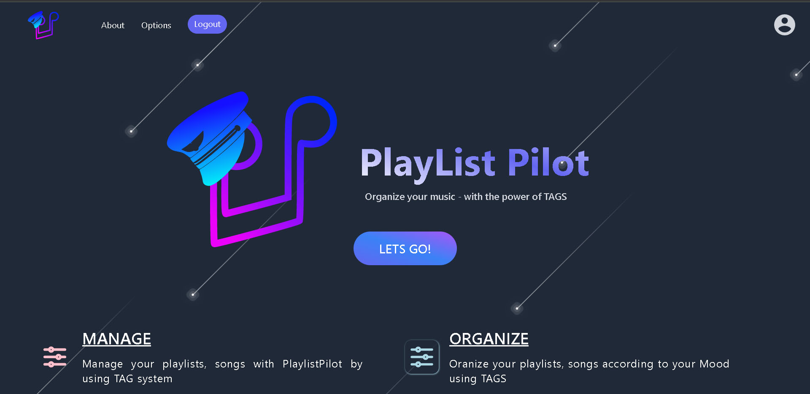
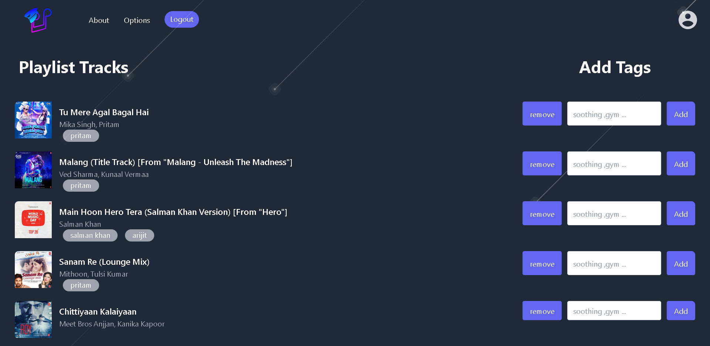

# PlaylistPilot (Music Organizer)

PlaylistPilot is a Music Organizer web application. It is based on TAG system, it allows user to create, modify playlist on the basis of TAGS.This application makes it easy to sort through large music libraries by enabling the use of tags to categorize songs by artist name, band name, genre, moods, and much more.

## Technology Used :
* Next.js 
* Tailwind Css 
* JavaScript 
* Node.js 
* MongoDB

## Images:

<!-- [Link to the Project](https://vmartfrontend.onrender.com/ "V-Mart") -->    

